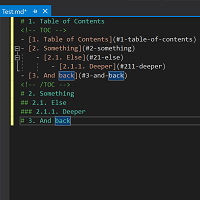

# FAST TOC

Download the extension at the
[VS Gallery](https://marketplace.visualstudio.com/items?itemName=CupOfTea.FastTOC)

-------------------------------------------------

A Visual Studio extension for easily adding a Table of Content any file.

Simply mark your indentation with # then in Tools click on 'Update TOC'.

See the [changelog](CHANGELOG.md) for updates and roadmap.

### Features

- Easily create and maintain a Table of Content

### License
[Copyright](Copyright.txt)